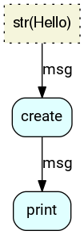

# RFlow - A workflow framework for agile machine learning

[](https://gitlab.com/otaviog/rflow/commits/master)

## Introduction

The Research Flow (RFlow) is a Python framework for creating
Directed Acyclic Graph (DAG) workflows. The project's goal is to
remove boilerplate code from common machine learning stages like data
preprocessing, model fitting and evaluation.

The image below shows the graph visualization of the [MNIST
classification example](doc/samples/mnist). Rflow managed the
connections from dataset parsing, training, to testing, alongside its
parameter values:


In the example above, the training node is defined like:

```python
class Train(rflow.Interface):
    # The `evaluate` funtion is every node's execution entry point.
    # Every argument is tracked by rflow (unless if it's specified in `non_collateral`)
    # Node are executed again if the tracked argument changes after the previous run.
    def evaluate(self, resource, train_dataset, test_dataset,
                 batch_size, test_batch_size, epochs, learning_rate=1.0, gamma=0.1,
                 device="cuda:0", log_interval=10):
        """Trains the Mnist model.
        """
		
        from torch.utils.data import DataLoader
        from torch.optim.lr_scheduler import StepLR
        import torch.optim as optim

        train_loader = DataLoader(...)
        test_loader = DataLoader(...)

        model = Net().to(device)
        model.train()
	    ... 
		
        for epoch in range(1, epochs + 1):
            train(model, device, train_loader,
                  optimizer, epoch, log_interval)
            test(model, device, test_loader)
	
		...

        torch.save(model.cpu(), resource.filepath)
        return model.to(device)

    # When nodes are update, then rflow calls load instead of evaluate.
    def load(self, resource, device):
        """Loads trained model
        """
        return torch.load(resource.filepath).to(device)

    def non_collateral(self):
        """Lists arguments that doesn't change the node's output.
        """
        return ["device", "log_interval"]
```

Joining with other nodes for loading dataset and testing, an experiment's DAG can be created by a function decorated with `@rflow.graph`:

```python
@rflow.graph()
def mnist_train(g):
    # Resources are output definitions. FSResources represent local files.  
    g.dataset = LoadDataset(rflow.FSResource("data"))

    g.train = Train(rflow.FSResource("model.torch"))
    with g.train as args:
        args.train_dataset = g.dataset[0]
        args.test_dataset = g.dataset[1]
        args.batch_size = 64
        args.test_batch_size = 1000
        args.epochs = 14
        args.learning_rate = 1.0
        args.gamma = 0.1
        args.device = "cuda:0"

    g.test = Test()
    with g.test as args:
        args.model = g.train
        args.test_dataset = g.dataset[1]
        args.test_batch_size = 1000
        args.device = "cuda:0"
```

The graph then can be executed with a shell command like the following:

```shell
$ rflow mnist_train run test
```

Where `test` is the node's name. It's possible to specify to run until any node.

## More information

* [Tutorial](https://otaviog.gitlab.io/rflow/wordcounter/tutorial.html)
* [Reference
  documentation](https://otaviog.gitlab.io/rflow)

Currently the project focus on workflows of prototype experiments,
targeted into single machine users.

This project is under development, but should be usable for small
projects.

## Getting Started

Python>=3.4 is required. It's recommend to install graphviz.

```shell
$ sudo apt install graphviz
```

Install using pip:

```shell
$ pip install git+https://github.com/otaviog/rflow
```

For development setup, please refer to the [CONTRIBUTING
guide](CONTRIBUTING.md).

Create your first workflow:

```python
import rflow

class CreateMessage(rflow.Interface):
    def evaluate(self, msg):
        return msg

class Print(rflow.Interface):
    def evaluate(self, msg):
        print(msg)

@rflow.graph()
def hello(g):
    g.create = CreateMessage()
    g.create.args.msg = "Hello"

    g.print = Print()
    g.print.args.msg = g.create

if __name__ == '__main__':
    rflow.command.main()
```

Save it as workflow.py and run with `rflow` command:

```shell
$ rflow hello run print
UPDATE  hello:print
.UPDATE  hello:create
.RUN  hello:create
.^hello:create
RUN  hello:print
Hello
^hello:print
```

Use the command `viz-dag` to visualizate the DAG:

```shell
$ rflow hello viz-dag
```


