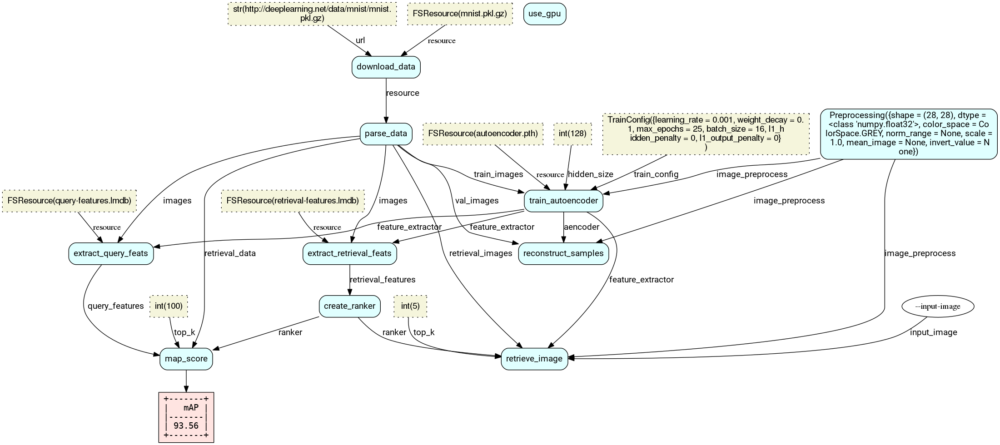

# RFlow - A workflow framework for end-to-end research

## Introduction

The Rflow (or Reentrant Flow) project is Python framework for creating
Directed Acyclic Graph (DAG) workflows. Our goal is to aid developers
in developing end-to-end stages of data preprocessing, model fitting
and evaluation with less boilerplate code. Making reproducible
research easier for the Information Retrieval and Machine Learning
communities.

The image below shows the graph visualization of a [MNIST autoencoder
retrieval
experiment](https://gitlab.com/shrkit/shape-retrieval-toolkit/tree/master/experiments/mnist). Rflow
managed the connections of user's code, from dataset parsing to
autoencoder training, evaluation, and empirical test.



For example, the training node is defined as in the following snippets:

```python
class TrainFeatureExtractor(rflow.Interface):

    def non_collateral(self):
        # Using GPU or not doesn't change final training.
        return ["use_gpu"] 

    # Rflow stores every argument not listed in non_collateral().
	# So it knows when arguments are changed, executing nodes and its dependencies when needed.
	
    def evaluate(self, resource, train_images, hidden_size,
                 train_config, image_preprocess, show_debug=False,
                 use_gpu=False):
        # Training using PyTorch, Tensorflow, ...		 
        return <trained model>

# Define other Interfaces

@rflow.graph()
def mnist(g):

    # Create other nodes ...
	
    # Sample user argument from command line
    g.use_gpu = rflow.UserArgument(
        '--use-gpu', action='store_true',
        help="Whatever to use GPU")

    # Create other nodes ...
	
    g.train_autoencoder = TrainFeatureExtractor(
        rflow.FSResource('autoencoder.pth')) # FSResource is the node's reentrant checkpoint file.
    with g.train_autoencoder as args:
        args.train_images = train_data
        args.hidden_size = 128
        args.train_config = autoencoder.TrainConfig(
            25, 16, 0, 0, 0.001, 0.1)
        args.image_preprocess = g.preprocessing
        args.use_gpu = g.use_gpu

```

For more information see the following links:

* [Workflow
  tutorial](https://shrkit.gitlab.io/rflow/wordcounter/tutorial.html)
* [Reference
  documentation](https://shrkit.gitlab.io/rflow)
* [Sample MNIST character
  retrieval](https://gitlab.com/shrkit/shape-retrieval-toolkit/tree/master/experiments/mnist)
* [Multiview Deep Neural Net
  Experiment](https://gitlab.com/shrkit/multiview-dnn)
* [Retrieval using spectral Descriptors
  Experiment](https://gitlab.com/shrkit/spectral-retrieval)

This project is still under development.

## Getting Started

Currently, shrkit is only available on Linux systems and requires
Python 3. The required environment packages (Ubuntu):

```shell
$ sudo apt install git python3-venv python3-pip graphviz
```

For development setup, please refer to the [CONTRIBUTING
guide](CONTRIBUTING.md).

## Similar Projects 

* [Luigi](https://github.com/spotify/luigi) - Spotify's workflow tool.
* [Airflow](https://airflow.apache.org/) - Apache's workflow tool.
* [Weka](http://www.cs.waikato.ac.nz/ml/weka/) - Machine learning workflow and toolkit.
* [Microsoft Asure for Machine Learning](https://studio.azureml.net) -
  A GUI workflow for machine learning pipelines.
